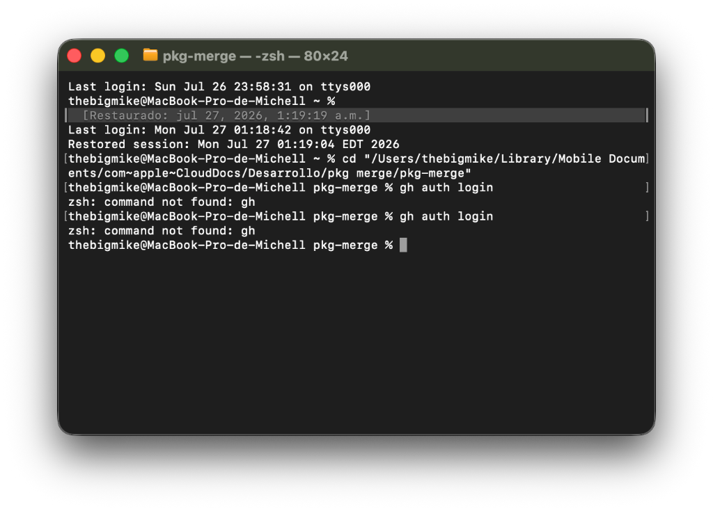

# 🗡️ PKGMachete

**PKGMachete** is the ultimate tool for macOS users designed to efficiently merge split PlayStation 4 and PlayStation 5 PKG files. With a lightning-fast engine written in C++ and a visually stunning interface built in SwiftUI, merging your backups has never been easier, faster, and more stylish.

## ✨ Key Features

*   🎮 **Full PS4 & PS5 Support:** A guaranteed two-pass algorithm prevents corrupted or orphaned files, processing PKGs with absolute precision.
*   ⚡ **C++20 Multi-Threading Engine:** Unlocks absolute peak storage performance via hardware-level concurrency and un-cached (`F_NOCACHE`) parallel I/O allocations on macOS.
*   🛡️ **Magic Bytes Validation:** Anti-tamper pre-flight system safely blocks fake chunks or Scene manipulations before performing the merge.
*   🎨 **"Premium/Gamer" UI:** Enjoy an immersive visual experience with a modern Glassmorphism design, cyberpunk dark themes, and sleek cyan gradients running on fully asynchronous rendering to avoid UI freezes.
*   🌍 **Dynamic Multi-language i18n:** Instantly switch between 15 languages (including Venezuelan Spanish, French, Portuguese, Japanese, Esperanto, and more) without restarting the app.
*   ⏱️ **Live ETA Calculation:** A smart mathematical algorithm calculates and displays the exact estimated time of completion in real-time.
*   📂 **Custom Output Directory:** Flexibility to choose and save your merged files exactly in the folder you want.
*   💻 **Integrated Log Console:** Monitor detailed live progress directly from the app's interface, visualizing the background work of the C++ engine encoded flawlessly in JSON.

## 📸 Screenshots

## 🚀 Installation

Installing **PKGMachete** is a simple and straightforward process. We've included an automated solution for macOS security blocks.

1.  Download the latest **`.dmg`** file from the Releases section.
2.  Open the `.dmg` by double-clicking it.
3.  Drag the **PKGMachete** app icon to your **Applications** folder shortcut.
4.  **⚠️ IMPORTANT:** To bypass Gatekeeper blocks and run the app smoothly, double-click the **`.command`** file included inside the DMG. This script will set everything up automatically.
5.  All set! You can now start using the application normally.

## 🤝 Credits & Acknowledgements

This project is the result of dedication, reverse engineering, and passion for development:

*   **Tustin:** Creator of the original CLI engine in C++ for Windows ([Tustin/pkg-merge](https://github.com/Tustin/pkg-merge)). Full credit goes to him for the original algorithm engineering and program foundation!
*   **VenezuenBiggie24:** Developer of the native macOS port (`clang++` compilation) and creator of the entire user experience (UX) and graphical user interface (UI) in SwiftUI.
    > *Biography:* "Enthusiastic self-taught developer, a Venezuelan living around the world thanks to a dictatorship that expelled me from my own country."

---
*Made with 🫀 and lots of dedication.*
